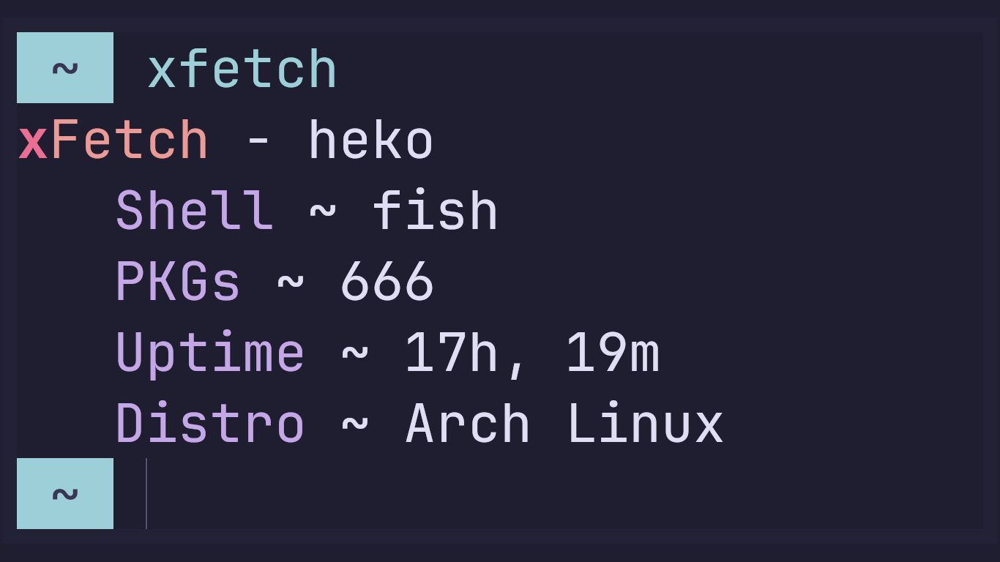

### xFetch

World's _fastest_* and simplest fetch.


-7ED321?logo=hack-the-box&logoColor=fff&style=for-the-badge)


## Arch User Repository

```sh
<AUR> -S xfetch-bin
```

### Build

```sh
git clone https://codeberg.org/XDR/xFetch.git
cd xFetch
RUSTFLAGS="-Zlocation-detail=none" cargo build --target x86_64-unknown-linux-gnu --profile release -Z build-std=std,panic_abort -Z build-std-features=panic_immediate_abort
```
