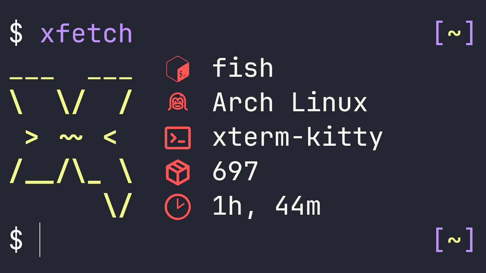

### xFetch

World's _fastest_* fetch.


-7ED321?logo=hack-the-box&logoColor=fff&style=for-the-badge)

## Installation
```sh
mkdir xFetch && cd xFetch/; curl -o PKGBUILD 'https://aur.archlinux.org/cgit/aur.git/plain/PKGBUILD?h=xfetch-bin'; makepkg --si
```


## Build

```sh
git clone https://codeberg.org/pparaxan/xFetch.git
cd xFetch
RUSTFLAGS="-Zlocation-detail=none" cargo build --target x86_64-unknown-linux-gnu --profile release -Z build-std=std,panic_abort -Z build-std-features=panic_immediate_abort
```
